  

  

  

 

  

<strong>Data Science Professional · AI/ML · NLP & LLMs · Signal Processing · Computational Neuroscience</strong>

 

Python · R · MATLAB · Deep Learning · Transformers · RAG · Computer Vision · FPGA / Edge AI · Statistical Data Analysis

